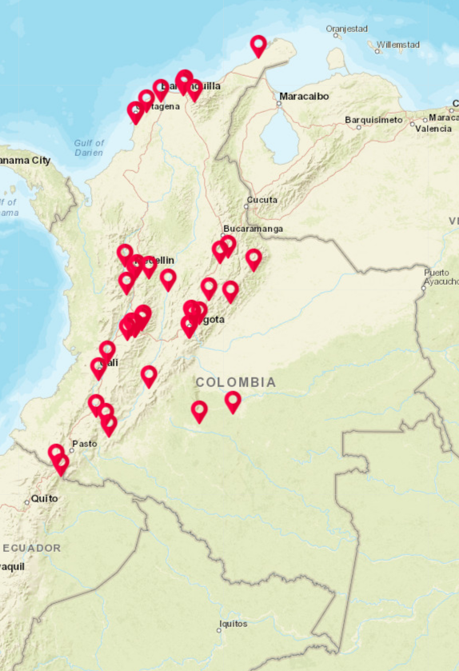

# Mapa de Lugares Turísticos de Colombia 🗺️🇨🇴

Este proyecto muestra en un mapa interactivo diferentes lugares turísticos de Colombia usando LeafletJS y datos abiertos de [api-colombia.com](https://api-colombia.com/).

## Descripción

Un sitio estático que permite visualizar ubicaciones turísticas con imágenes, descripciones y enlaces relevantes. Ideal para viajeros, investigadores o cualquier persona interesada en explorar Colombia de manera visual.

## Tecnologías usadas

- HTML, CSS y JavaScript
- [LeafletJS](https://leafletjs.com/)
- [API de Colombia](https://api-colombia.com/)
- GitHub Pages

## Mapa Turístico



## ¿Cómo correr el proyecto localmente?

```bash
git clone https://github.com/TU_USUARIO/turismo.git
cd turismo
# Abre index.html directamente en tu navegador

Licencia

Este proyecto está bajo la licencia MIT.
Copyright © Juan Pablo Díaz

Basado originalmente en una plantilla de ColombiaPython/map-meetups, con modificaciones y desarrollo adicional por Juan Pablo Díaz.

---

Con esta estructura, **todo el crédito principal es tuyo**, y se hace una mención técnica al final como corresponde por la licencia. ¿Quieres que te lo genere como archivo `.md` directamente?
```
